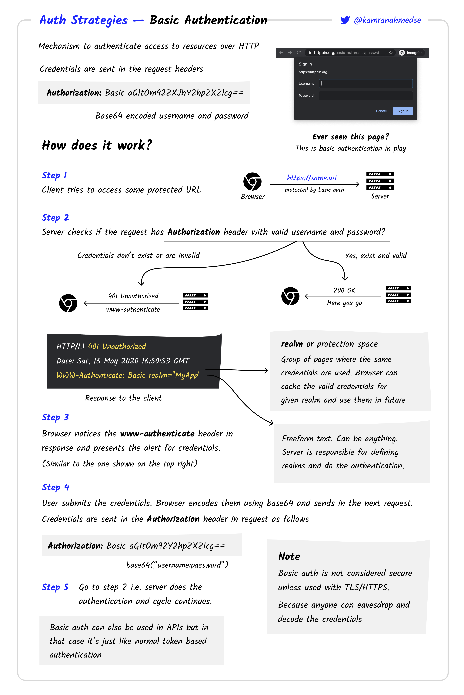

# Basic Authentication con Node.js e TypeScript

Questo progetto implementa un semplice server Node.js con Express e TypeScript, che utilizza la Basic Authentication per proteggere le risorse.

## Cos'è la Basic Authentication?

La Basic Authentication è uno dei metodi più semplici per proteggere le risorse di un'applicazione web. In questo schema, il client invia le credenziali (nome utente e password) con ogni richiesta HTTP. Queste credenziali sono codificate in Base64 e incluse nell'intestazione della richiesta.



### Come Funziona

1. **Richiesta Senza Credenziali**: Quando il client tenta di accedere a una risorsa protetta senza fornire credenziali, il server risponde con uno stato HTTP `401 Unauthorized` e un'intestazione `WWW-Authenticate`.
2. **Prompt del Browser**: Il browser rileva questa risposta e mostra automaticamente una finestra di dialogo per richiedere le credenziali all'utente.
3. **Invio delle Credenziali**: Una volta inserite, le credenziali vengono inviate al server nell'intestazione `Authorization`, codificate in Base64.
4. **Verifica sul Server**: Il server decodifica e verifica le credenziali. Se corrette, la richiesta procede; altrimenti, viene negata.

## Vantaggi della Basic Authentication

- **Semplicità**: È facile da implementare e non richiede setup complessi.
- **Compatibilità**: È supportata nativamente da tutti i browser moderni.
- **Utilizzo Standard**: La Basic Authentication è uno standard consolidato ed è compatibile con la maggior parte dei client HTTP.

## Svantaggi della Basic Authentication

- **Sicurezza Limitata**: Le credenziali vengono inviate con ogni richiesta e, se non usato HTTPS, possono essere facilmente intercettate.
- **Esperienza Utente**: Il prompt di autenticazione del browser può essere meno flessibile e meno personalizzabile rispetto ai form di login personalizzati.
- **Mancanza di Persistenza**: Non c'è un meccanismo integrato per gestire sessioni o autenticazioni più avanzate, come l'expiry dei token.

## Implementazione in questo Progetto

### Middleware di Autenticazione

Il middleware `authMiddleware` è responsabile della gestione della Basic Authentication. Viene utilizzata la libreria `basic-auth` per estrarre e verificare le credenziali dalla richiesta HTTP.

```typescript
import { Request, Response, NextFunction } from 'express';
import basicAuth from 'basic-auth';
import { config } from '../config';

export const authMiddleware = (req: Request, res: Response, next: NextFunction) => {
  const user = basicAuth(req);

  if (!user || user.name !== config.auth.username || user.pass !== config.auth.password) {
    res.set('WWW-Authenticate', 'Basic realm="example"');
    return res.status(401).send('Accesso negato');
  }

  next();
};
```

### Configurazione delle Credenziali

Le credenziali di autenticazione sono definite nelle variabili d'ambiente nel file `.env`:

```sh
BASIC_AUTH_USERNAME=admin
BASIC_AUTH_PASSWORD=password
```

Queste variabili vengono utilizzate nel middleware per confrontare le credenziali fornite dal client.

### Rotte Protette

Le rotte che necessitano di autenticazione vengono protette applicando il middleware `authMiddleware`. Ad esempio:

```typescript
import { Router } from 'express';
import { AuthController } from '../controllers/authController';
import { authMiddleware } from '../middleware/authMiddleware';

const router = Router();

router.get('/protected', authMiddleware, AuthController.getProtectedResource);

export default router;
```

### Esecuzione del Server

Dopo aver installato le dipendenze e configurato l'ambiente, puoi avviare il server con:

```bash
npx nodemon
```

Il server sarà accessibile su `http://localhost:3000`, e la risorsa protetta sarà accessibile su `http://localhost:3000/api/protected`.

## Considerazioni Finali

La Basic Authentication è adatta per scenari semplici e dove la sicurezza non è una preoccupazione primaria. Per applicazioni in produzione o dove è necessario un livello di sicurezza più elevato, è consigliabile utilizzare metodi di autenticazione più avanzati come OAuth, JWT (JSON Web Tokens), o sessioni server-side.

In questo progetto, la Basic Authentication è stata implementata per fornire un esempio chiaro e semplice di come proteggere le risorse in un'applicazione Node.js utilizzando TypeScript.

Questo `README.md` fornisce una panoramica dettagliata della Basic Authentication, i suoi vantaggi e svantaggi, e descrive come è stata implementata nel tuo progetto specifico. È progettato per aiutare chiunque a comprendere non solo come funziona la Basic Authentication, ma anche come è stata applicata in questo contesto.